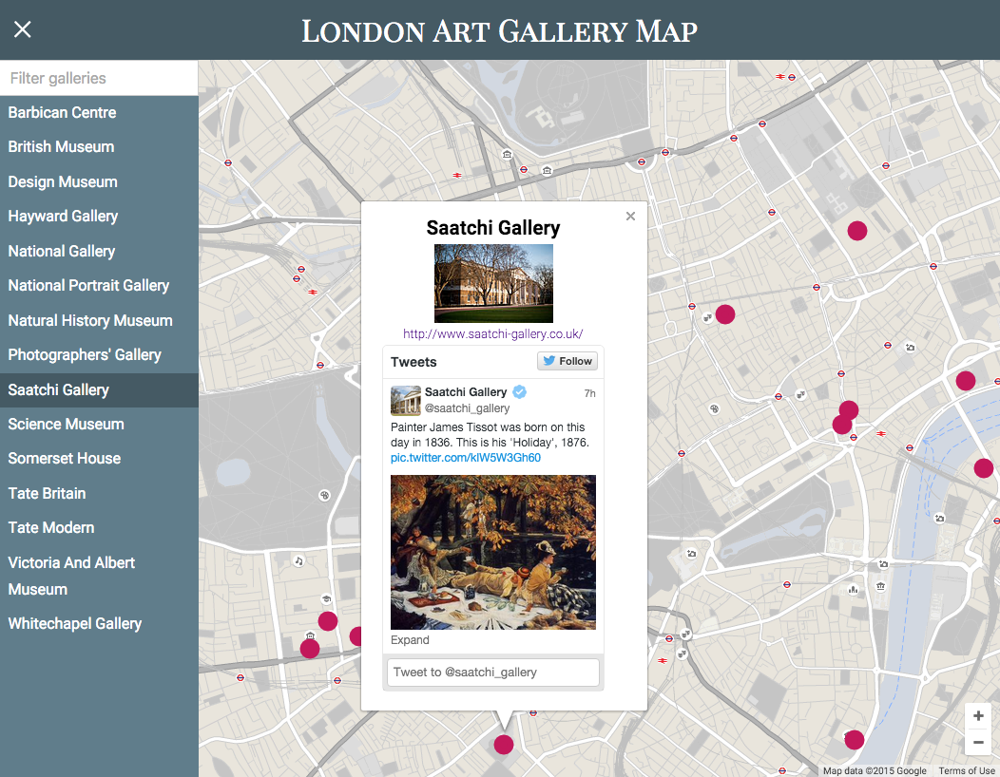

# London Art Gallery Map

This application shows the information about some of the major art galleries and museums (called 'galleries' in this document) in central London. The galleries are shown in red small circles on the map. Click on one of the circles to get more information about the gallery.

The list on the left hand side provides the names of galleries shown in the map. If the list is not shown, click on the hamburger menu icon in the top left corner of the screen, which opens the list. Clicking on one of the gallery names shows the information about the gallery, just like clicking on the red circle mentioned above.

You can filter the gallery names in the list by typing in a key word in the text box located at the top of the gallery name list. After pressing the enter key, the gallery names in the list are reduced to the ones which only contain the key word in the name. Simply deleting the keyword in the text box and press the enter key restores the original list of the gallery names.

The information about the galleries was taken from [Wikipedia](en.wikipedia.org/wiki/List_of_museums_in_London). The [Twitter API](dev.twitter.com/web/javascript) is used to retrive tweets from the galleries.

## Run instructions

This application is intended to be run in localhost, therefore it is necessary to have a local HTTP server to host this application.

1. Start a local HTTP server in the directory where the index.html exists. You can use any HTTP server. I personally use [Python's SimpleHTTPServer](http://www.pythonforbeginners.com/modules-in-python/how-to-use-simplehttpserver/).
2. Access the index.html on the local HTTP server.

## Screenshot

